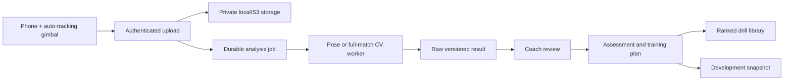

# TrainingBuddy

TrainingBuddy is a privacy-aware applied-ML platform for youth-football video
analysis and coach-reviewed player development. It accepts phone/gimbal video,
runs background computer-vision jobs, preserves raw evidence, and converts
approved findings into development snapshots, training plans, and drill
recommendations.

> The software pipeline is production-oriented; the football detector is not
> production-approved until a representative labelled dataset passes the
> documented release gate.

## Why this is an applied data-science project

- MediaPipe pose measurements for controlled single-player movements.
- YOLO-based full-match player/ball detection and persistent tracking.
- Match-isolated dataset validation and content fingerprints.
- Generic-baseline versus fine-tuned evaluation with held-out test metrics.
- Per-class detection, event timestamp, and transparent association metrics.
- Human review/approval before automated findings influence a plan.
- Monte Carlo development scenarios with visible uncertainty assumptions.
- Private local or S3-compatible video storage, PostgreSQL, migrations, and CI.
- Guardian consent, linked-child authorization, privacy requests, and auditing.

## Architecture



## Local development

```bash
python -m venv .venv
source .venv/bin/activate
pip install -r requirements.txt
alembic upgrade head
pytest
uvicorn main:app --reload
```

Vision dependencies are installed separately:

```bash
pip install -r requirements-vision.txt
```

## Reproducible football ML

See [`ml/README.md`](ml/README.md), [`ml/DATASET_CARD.md`](ml/DATASET_CARD.md),
and [`ml/MODEL_CARD.md`](ml/MODEL_CARD.md). The workflow is:

1. Collect consented phone/gimbal matches and annotate private frames.
2. Assign entire matches to splits with `scripts.assign_football_splits`.
3. Validate labels, lineage, consent references, and leakage.
4. Train with a fixed seed and compare against a task-compatible prior model.
5. Evaluate detections, tracking associations, and event timestamps.
6. Inspect structured errors and approve only if every release gate passes.

## Quality and safety

The test suite covers domain validation, APIs, migrations, authorization,
privacy workflows, storage, background analysis, recommendation logic, pose
analysis, match tracking, dataset validation, and ML release gates. CI enforces
85% branch-aware coverage, migrations on PostgreSQL, Ruff, Bandit, dependency
audit, and a Docker build.

Automated output supports coaching; it does not make medical, identity,
eligibility, contract, or safeguarding decisions. Face recognition is not used.

## Portfolio evidence

Read [`PORTFOLIO_CASE_STUDY.md`](PORTFOLIO_CASE_STUDY.md) for the problem,
system boundary, evaluation table, and honest remaining limitations. Replace
`Pending` values only with reports generated from the unchanged held-out test
set.
